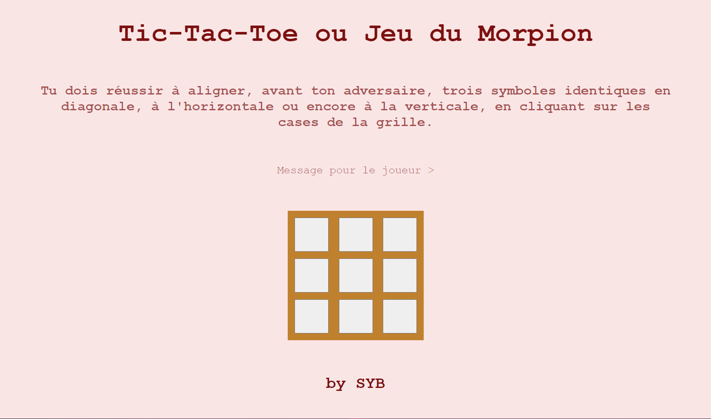

# tic-tac-toe 🇬🇧 ou jeu du morpion 🇫🇷

Bienvenue à toi !

Voici le tic-tac-toe pour les anglophones ou jeu du morpion pour les francophones. 

## Règles du jeu : 

Voici une grille de trois cases sur trois. Le but du jeu est d'aligner avant ton adversaire trois symboles identiques horizontalement, verticalement ou en diagonale pour gagner la partie.

Let's started !

